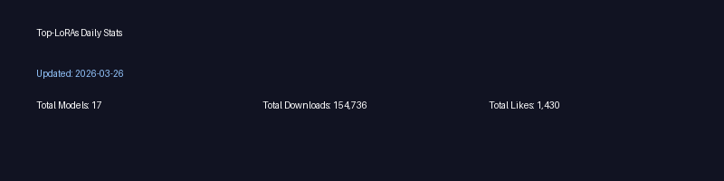

---
# 详细文档见https://modelscope.cn/docs/%E5%88%9B%E7%A9%BA%E9%97%B4%E5%8D%A1%E7%89%87
domain: #领域：cv/nlp/audio/multi-modal/AutoML
# - cv
tags: #自定义标签
-
datasets: #关联数据集
  evaluation:
  #- iic/ICDAR13_HCTR_Dataset
  test:
  #- iic/MTWI
  train:
  #- iic/SIBR
models: #关联模型
#- iic/ofa_ocr-recognition_general_base_zh

## 启动文件(若SDK为Gradio/Streamlit，默认为app.py, 若为Static HTML, 默认为index.html)
# deployspec:
#   entry_file: app.py
license: MIT License
---
# Top-LoRAs
---
# For detailed docs see: https://modelscope.cn/docs/creatives-card
domain: # domain: cv/nlp/audio/multi-modal/AutoML
tags: []
datasets:
  evaluation: []
  test: []
  train: []
models: []
license: MIT License
---

# Top-LoRAs

## Project Summary

This repository provides a small pipeline and a read-only Gradio UI that builds a "Top LoRAs" leaderboard using ModelScope frontend JSON. The project:

- Fetches the ModelScope frontend JSON and extracts concise model metadata.
- Applies conservative LoRA detection and filtering rules to reduce false positives.
- Writes a compact cache JSON (no model blobs) and optionally downloads cover images into `cache/`.
- Provides a CLI (`python -m top_loras`) to refresh caches and configure paging/limits.
- Includes a lightweight Gradio app (`app.py`) that reads the cache and renders a styled card grid.


## 📊 Daily Statistics



*Statistics updated automatically every day*


## 🏆 Top 3 Models

| # | Cover | Model | Author | Downloads | Likes |
| --- | --- | --- | --- | --- | --- |
| 1 |  | [FLUX_xiao_hong_shu_ji_zhi_zhen_shi_V2](https://modelscope.cn/yiwanji/FLUX_xiao_hong_shu_ji_zhi_zhen_shi_V2?revision=v1.0) | yiwanji | 62,596 | 258 |
| 2 |  | [ArtAug-lora-FLUX.1dev-v1](https://modelscope.cn/DiffSynth-Studio/ArtAug-lora-FLUX.1dev-v1?revision=v1.0) | Artiprocher | 38,798 | 76 |
| 3 |  | [MAJICFLUS-photo](https://modelscope.cn/WANGMOON/MAJICFLUS-photo?revision=v1.0) | WANGMOON | 16,570 | 91 |


## Quick start

1. Create and activate a Python environment (example using conda):

```bash
conda create -n ms python=3.10 -y
conda activate ms
pip install -r requirements.txt
```

2. Run the Gradio app (it reads `cache/top_loras_text-to-image-synthesis.json` by default):

```bash
python app.py
```

Open http://127.0.0.1:7860 in your browser.

3. Refresh the cache from ModelScope (optional):

```bash
python -m top_loras --limit 20 --task text-to-image-synthesis --force-refresh
```

Cover images are downloaded from each record's `cover_url` when available. Most cover URLs are public and do not require a ModelScope API token. The CLI supports flags such as `--limit`, `--page-size`, `--max-pages`, `--no-per-task-cache`, and `--cache-file`. If a resource requires authentication (401/403), provide `MODELSCOPE_API_TOKEN` in the environment or configure it in CI.

## Cache schema (short)

The cache JSON contains a top-level `_cached_at` timestamp and a `results` array. Each result includes fields such as:

- `id`, `title_cn`, `title_en`, `author`, `author_avatar` (optional),
- `cover_url`, `cover_local` (if downloaded), `downloads`, `likes`,
- `tags_cn`, `tags_en`, `base_models`, `stable_diffusion_version`,
- `trigger_words`, `vision_foundation`, `updated_at`, `modelscope_url`.

See `DATA_INTERFACE.md` for a full table of fields and extraction fallback rules.

## Two-remote workflow (GitHub + ModelScope)

If you maintain this repository in two remotes (for example GitHub and a ModelScope studio git), you can add both remotes locally and push to both:

```bash
# add GitHub remote
git remote add github git@github.com:<user>/<repo>.git

# add ModelScope remote (example)
git remote add modelscope git@github.com:...  # replace with your ModelScope git URL or use HTTPS token

# push to both
git push -u github main
git push -u modelscope main
```

If ModelScope does not expose a git remote, consider using GitHub Actions to upload `cache/*.json` artifacts or use ModelScope's API to publish artifacts; I can provide a workflow template on request.

## Tests and CI

Run tests locally with:

```bash
pytest -q
```

CI (GitHub Actions) is included and can be configured to run tests and scheduled fetches. In most cases CI does not need a ModelScope token because cover images are downloaded from public `cover_url` links; only add `MODELSCOPE_API_TOKEN` as a secret when needed for protected resources or for generation steps that require authentication.

## Troubleshooting

### API submission failing with code 40212

If you see an error such as "submit failed with status code: 40212", try the following steps:

1) Validate your API token

```bash
# verify your token works
MODELSCOPE_DEBUG=1 python app.py
```

Or set the environment variable and run the diagnostic script:

```bash
export MODELSCOPE_API_TOKEN="your_token_here"
MODELSCOPE_DEBUG=1 python app.py
```

2) Check model ID formatting

Examples of incorrect and correct model IDs:

- Incorrect: `stable-diffusion-xl` (missing owner)
- Incorrect: `models/AI-ModelScope/stable-diffusion-xl` (extra path)

- Correct: `AI-ModelScope/stable-diffusion-xl`
- Correct: `damo/text-to-video-synthesis`

3) Common causes and remedies

| Error | Cause | Mitigation |
|------:|:------|:----------|
| 40212 | Model does not support API | Check the model page to see if inference API is supported |
| 40212 | Token lacks permission | Ensure token has image-generation permission |
| 401 | Invalid/expired token | Recreate token: https://modelscope.cn/my/myaccesstoken |
| 400 | Bad request parameters | Verify model ID format and request payload |

4) Important: many Top-LoRAs are user-uploaded LoRA packages and do not support the standard inference API

Supported API models (recommended):

- `AI-ModelScope/stable-diffusion-xl`
- `AI-ModelScope/stable-diffusion-v1-5`
- `damo/text-to-image-synthesis`

Examples of models that often do NOT support API usage:

- `yiwanji/FLUX_xiao_hong_shu_ji_zhi_zhen_shi_V2` (LoRA)
- Most user-uploaded fine-tuned models
- Any model whose metadata contains "LoRA", "FLUX", or "fine-tune"

If you need an API-compatible model, use the UI's "API Model Override (advanced)" field to provide a supported model ID, for example: `AI-ModelScope/stable-diffusion-xl`.

See the supported models list: [docs/SUPPORTED_MODELS.md](docs/SUPPORTED_MODELS.md)

5) Enable debug logging

Set `MODELSCOPE_DEBUG=1` in your shell to print detailed request/response information:

```bash
export MODELSCOPE_DEBUG=1
python app.py
```

This will print:
- API request URLs
- Model IDs used
- Partial token hints (prefixes)
- Full request and response payloads

6) Test recommended models

```bash
# Test Stable Diffusion XL
MODELSCOPE_DEBUG=1 python app.py --model AI-ModelScope/stable-diffusion-xl

# Test other supported models
MODELSCOPE_DEBUG=1 python app.py --model damo/cv_diffusion_text-to-image-synthesis_base
```

7) Use simulation mode for UI testing

If you do not need real inference, run without a token — the app will return simulated results for UI testing:

```bash
# run without setting a token (simulation mode)
python app.py
```

## Get help

- ModelScope API docs: https://modelscope.cn/docs/api-inference/intro
- Token management: https://modelscope.cn/my/myaccesstoken
- Open an issue: https://github.com/neverbiasu/ModelScope-Top-LoRAs/issues

## Notes

- The UI intentionally uses a conservative LoRA detection heuristic. To adjust detection, edit `top_loras/filter.py`.
- The `cache/` directory and downloaded images are normally not committed; add `cache/` to `.gitignore` if desired.
- For API debugging, use `MODELSCOPE_DEBUG=1 python app.py

---

If you want, I can commit this README change and prepare a GitHub Actions workflow to publish cache artifacts to ModelScope. Let me know whether you want me to push the commit or open a pull request.
- Cached images and the `cache/` folder are typically not committed; add `cache/` to `.gitignore` if you want to avoid checking images in.
